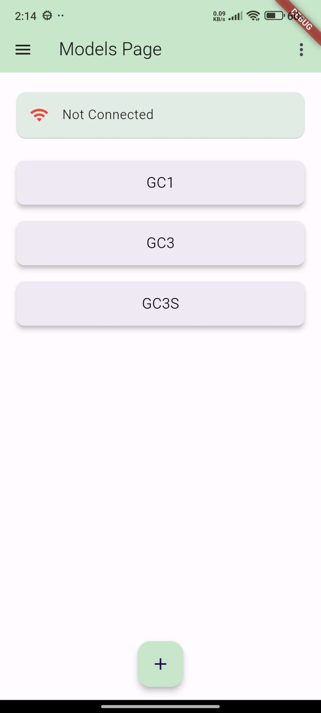
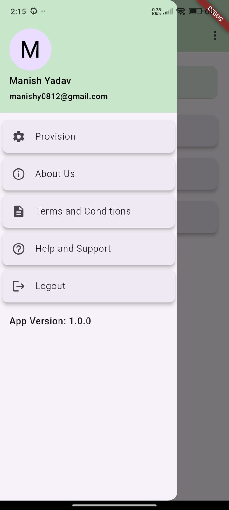
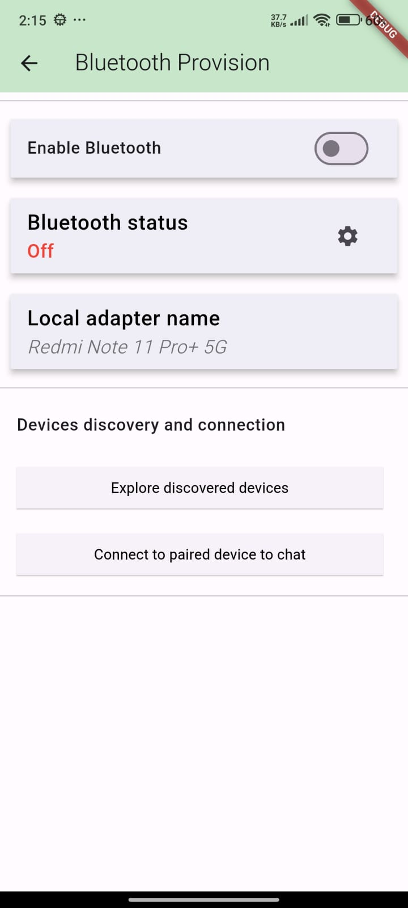
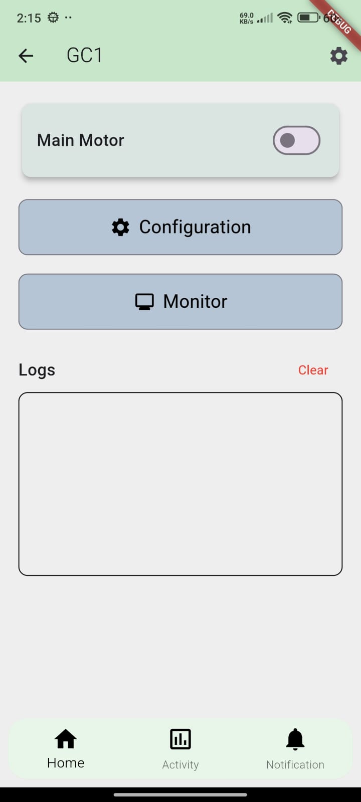
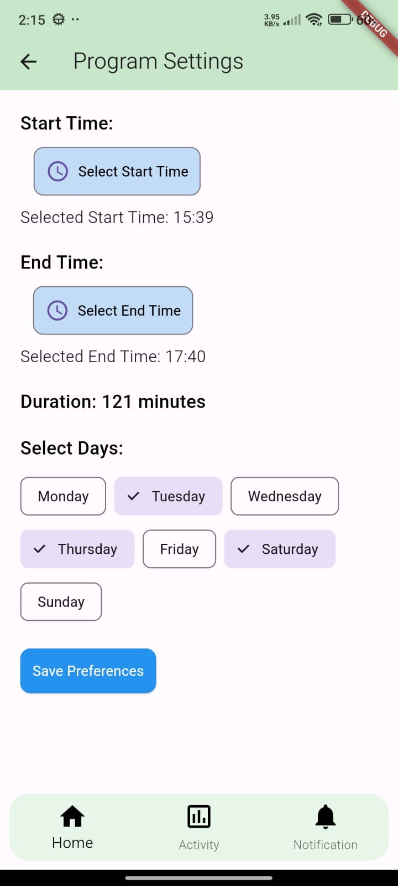
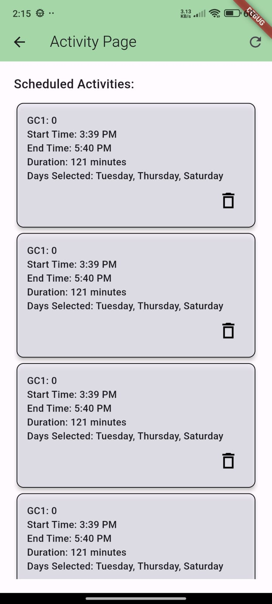
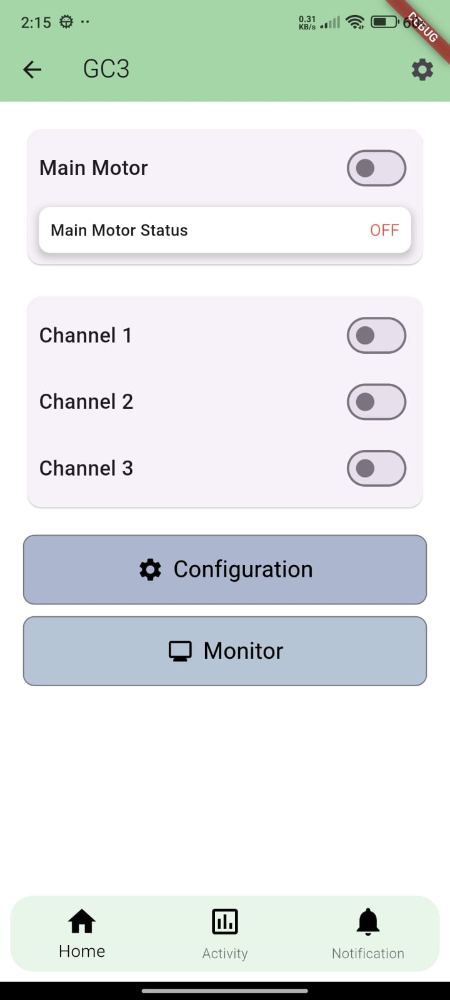

#Garden Mate App 

Overview
----------------------------------------------------------------
Garden Mate is a mobile application designed to help users manage and control their garden efficiently. The app allows users to monitor and control various garden devices, such as motors, sprinklers, and lighting systems, while providing scheduling features to automate tasks for optimal garden care.

Features
----------------------------------------------------------------
Motor Control: Control garden motors remotely.
Scheduling: Set schedules to automate motor operations.
Device Management: Manage various devices like lights, sprinklers, and motors.
Notifications: Get notified about scheduled tasks and device status updates.
User-Friendly Interface: Easy-to-use interface built with Flutter.

Technologies Used
----------------------------------------------------------------
Frontend: Flutter (Dart)
Backend: Flask (Python)
Database: Firebase 

Installation
----------------------------------------------------------------
Prerequisites

Flutter SDK
Python 3.x
Flask

Steps to Install
1. Clone the Repository:
git clone https://github.com/Manish2102/GardenMate
cd GardenMate
2. Install Flutter Dependencies:

In the root of the Flutter project, run:
flutter pub get

3. Run the Flutter App:

In the Flutter project directory, run:
flutter run

Contributing
----------------------------------------------------------------
Fork the repository.
Create a new branch (git checkout -b feature-name).
Make your changes.
Commit your changes (git commit -am 'Add new feature').
Push to the branch (git push origin feature-name).
Create a new Pull Request.